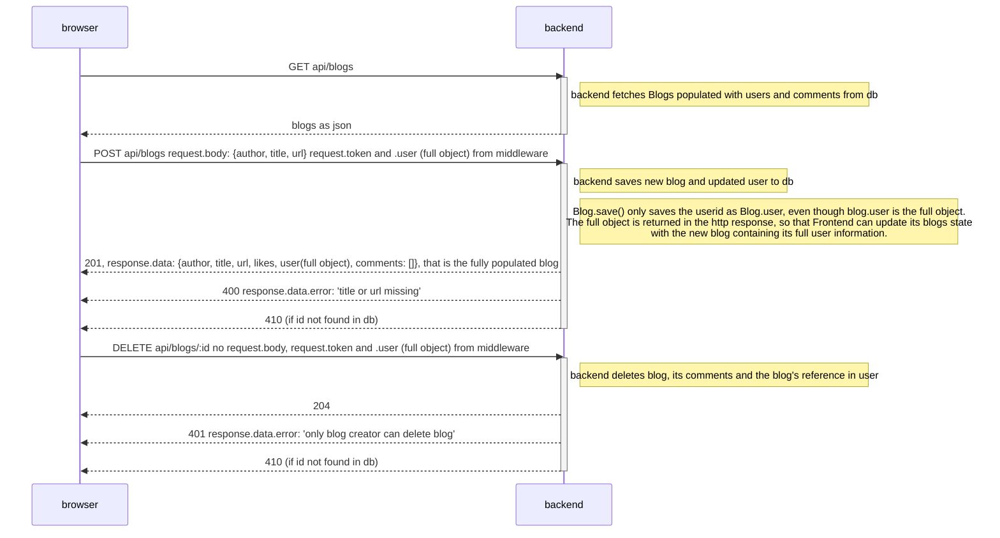

// To do: add flow for blog update (at the moment only likes can be updated) and check with tests
// To do: add flow for users (and functionality to GET only with authorization)

```mermaid
sequenceDiagram
    participant browser
    participant backend

	browser->>backend: GET api/blogs
    activate backend
    Note right of backend: backend fetches Blogs populated with users and comments from db
    backend-->>browser: blogs as json
    deactivate backend

    browser->>backend: POST api/blogs request.body: {author, title, url} request.token and .user (full object) from middleware
    activate backend
    Note right of backend: backend saves new blog and updated user to db
	Note right of backend: Blog.save() only saves the userid as Blog.user, even though blog.user is the full object. <br>  The full object is returned in the http response, so that Frontend can update its blogs state <br>  with the new blog containing its full user information.
    backend-->>browser: 201, response.data: {author, title, url, likes, user(full object), comments: []}, that is the fully populated blog
	backend-->>browser: 400 response.data.error: 'title or url missing'
	backend-->>browser: 410 (if id not found in db)
    deactivate backend

    browser->>backend: DELETE api/blogs/:id no request.body, request.token and .user (full object) from middleware
    activate backend
    Note right of backend: backend deletes blog, its comments and the blog's reference in user 
    backend-->>browser: 204
	backend-->>browser: 401 response.data.error: 'only blog creator can delete blog'
	backend-->>browser: 410 (if id not found in db)
    deactivate backend

```

